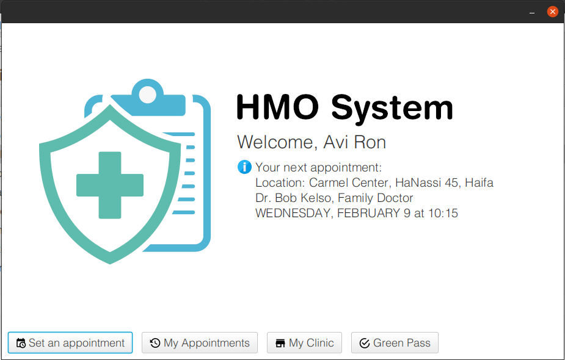
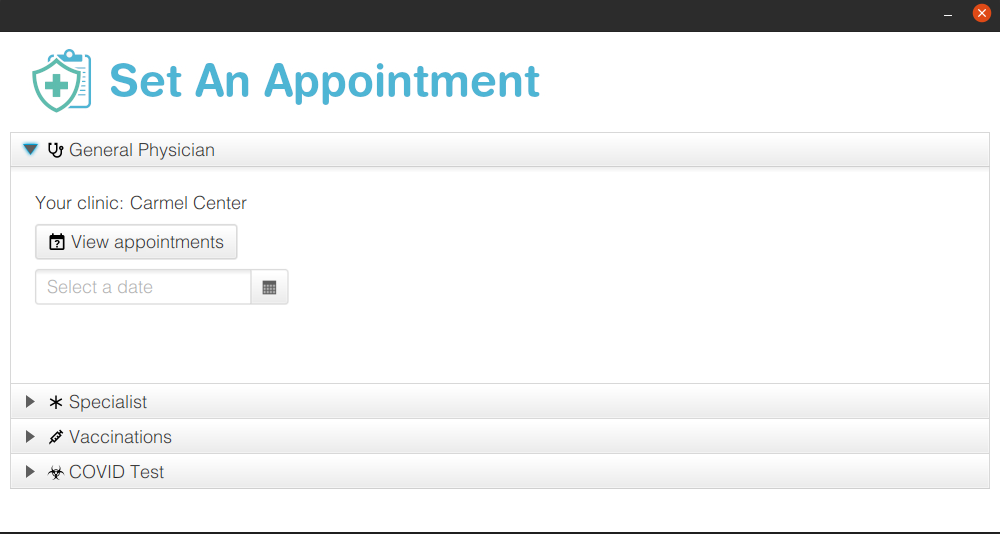
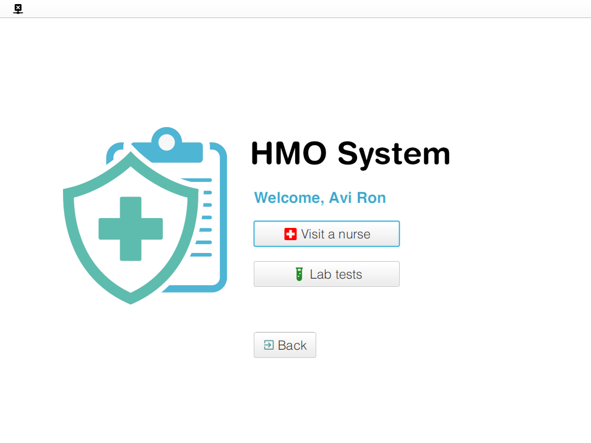
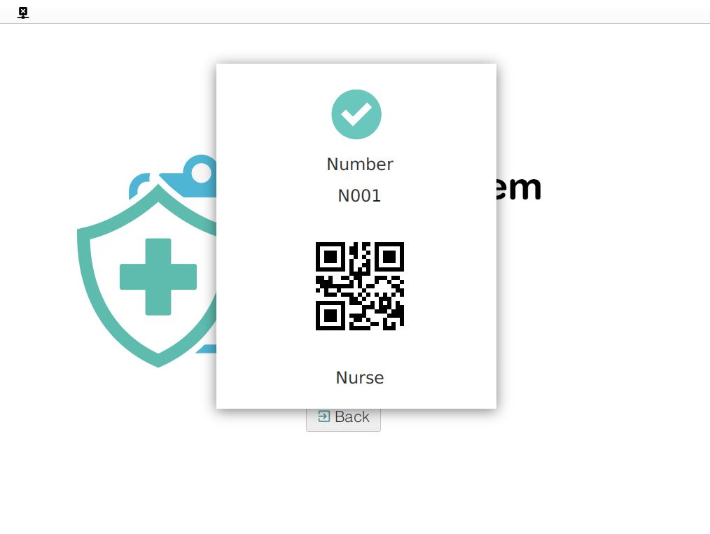
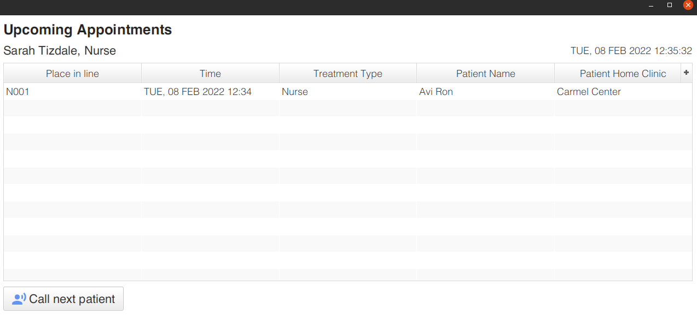

# HMO System
#### A system for managing patients, staff, clinics, and appointments for a medical organization.

Features a desktop application for patients & managerial staff as well as an application for use on 
clinic premises by staff members & patients arriving for appointments.

Written in Java using OCSF, ORM with MySQL, and an event-driven UI using JavaFX and
[greenrobot EventBus](https://github.com/greenrobot/EventBus).

## Screenshots

### Desktop App - Patient welcome screen

### Desktop App - Setting an appointment

### Clinic App - Logging in as a patient

### Clinic App - Receiving a number for the nurse's queue

### Clinic App - The nurse's queue (staff view)

